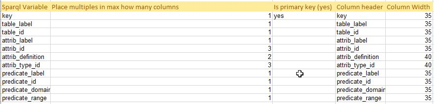

# RDLReporter

This is a generic report writer. In the report tab, enter a Sparql query and endpoint. This query may have one to many relationships in it. In the report this is taken care of by making multiple columns for such relationships. 

## Usage

A query may have one to many relationships in it. For example an object can have many rdf:type relationships. In the sparql query output these multiple relationships are listed one per whole new record, where all other values are repeated. In the report this is taken care of by making multiple columns for such relationships. For example, if an object has 3 rdf:type relationships to classes, you can put that in 3 columns titled “type”. So the multi column value is 3 for that field, and the program will create 3 type columns in Excel. 

Important:

- The report Sparql variables must be the same as selected in the query

- The primary key is the value that changes per single output record. It must be the first column and there must be a “yes” in the primary key setting. 

**Note:**  If you do not like it that it must be the first column, the output is Excel, so just move the columns after reporting, or make the first column a repeat of the real primary key, and delete it in Excel after reporting. 


## Program Parameters
1. Sparql Endpoint: _Row 2B_
2. Sparql Query: _Row 3B_

## Query Example

```Sparql
prefix dm: <http://data.15926.org/dm/>
prefix chifos: <http://data.15926.org/cfihos/>
select (?attrib_id as ?key) ?table_label ?table_id ?attrib_label ?attrib_id ?attrib_definition ?attrib_type_id ?predicate_label ?predicate_id ?predicate_domain ?predicate_range
{
?table_id rdfs:label ?table_label .
?table_id rdf:type ?modelid .
?modelid rdfs:label "cfihos data model"@en .

?attrib_id rdf:type ?table_id .
optional {?attrib_id rdfs:label ?attrib_label}
optional {?attrib_id skos:definition ?attrib_definition}
optional {?attrib_id rdf:type ?attrib_type_id}
filter not exists{?attrib_type_id rdf:type ?modelid . ?modelid rdfs:label "cfihos data model"@en . }

optional {?predicate_id rdfs:subPropertyOf ?attrib_id}
optional {?predicate_id rdfs:label ?predicate_label}
optional {?predicate_id rdfs:domain ?predicate_domain}
optional {?predicate_id rdfs:range ?predicate_range}
filter (!contains(str(?predicate_id),'owl'))

}
order by ?table_label ?attrib_label ?attrib_type_id

```

## Configure Result Set



1. Sparql Variable - The binding to which the variable will assign data to.
2. Place multiples in max how many columns - Addressing the carthesian product that will result from running a select query.
3. Is primary key - Used to identify which sparql variable will act as the record unique idenitifer.
4. Column header - Used for mapping the result bindings to a column on the result tab sheet.
5. Column Width - Result tab column width.


**Not Supported**

Construct Queries
